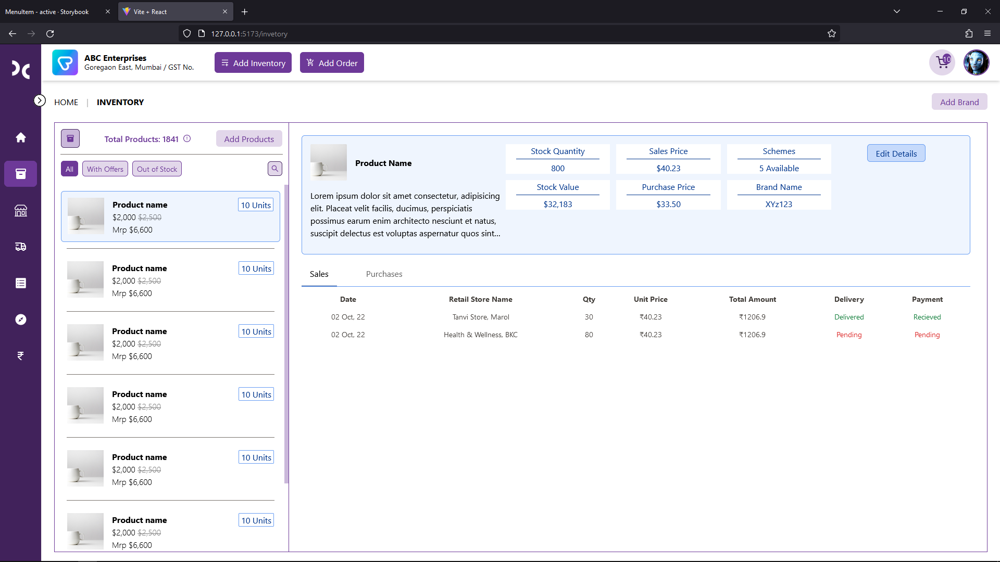

# Start Web App🔽

## Copy code localy :
`git clone https://github.com/MyDoco/BE-WebApp`
## Goto project location
`cd BE-WebApp`
## Install npm dependencies
`npm i`
## Start in dev server
`npm run dev`

# Site Image🔽
